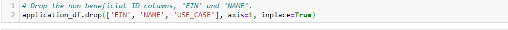
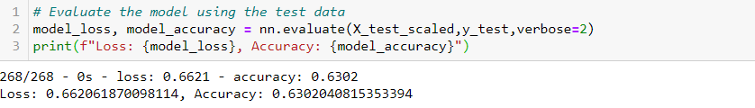
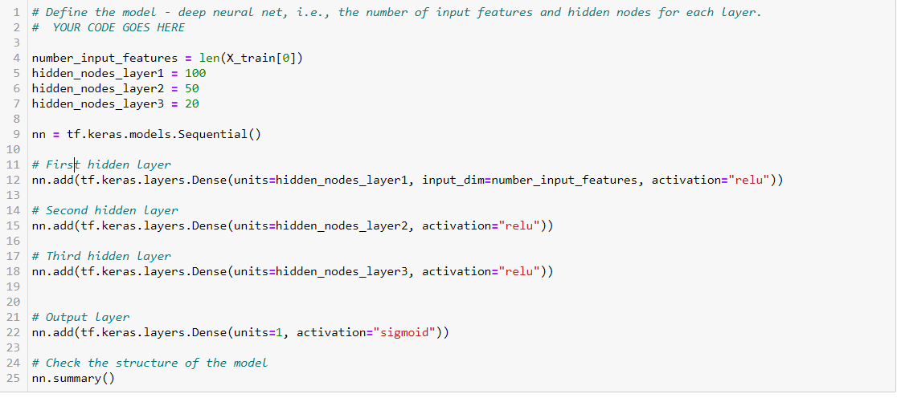
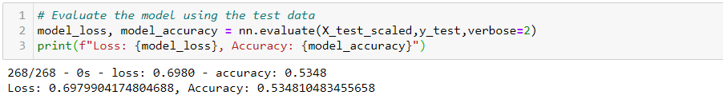
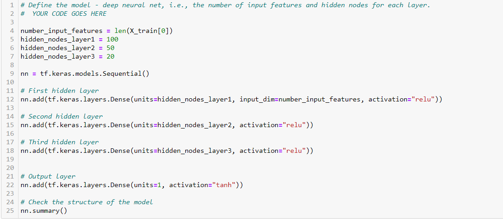
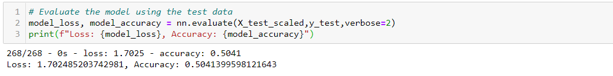

# Neural_Network_Charity_Analysis
The steps taken to try and increase model performance

- Attempt 1: Removed additional feature, that is the 'USE_CASE' column. Rest of the model components stayed the same, however model accuracy went down to 63%. 

-  Attempt 2: Adding Additional neurons to hidden layers and additional hidden layers are added. The accuracy went down again, this time it was 53%.

- Attempt 3: Changing activation function of output layer from "sigmoid" to "tanh." The accuracy of the model went down even more to 50%.

## Summary 

The model ended up with the accuracy score of 50% after optimization. The initial neural network had a accuracy score of 69%. This loss in accuracy can be explained from the fact that the model overfitted. Furthermore, we could further also optimize our neural network by removing more features or simply adding more data to the dataset to increase accuracy.
Since our accuracy score was not particularly up to the standard with neural networks, we could have used the Random Forest classifiers. This is because random forest is a robust and accurate model due to their sufficient number of estimators and tree depth. Also the random forest models have a faster performance than neural networks and could have avoided the data from being overfitted. 
